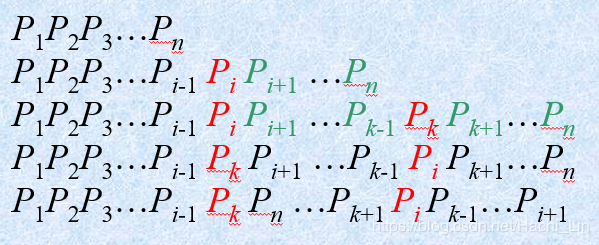
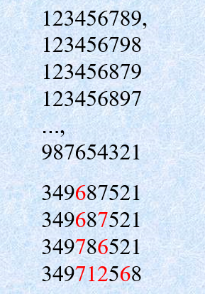

[]()

## 题目地址

https://leetcode-cn.com/problems/next-permutation/

## 题目描述

```
实现获取下一个排列的函数，算法需要将给定数字序列重新排列成字典序中下一个更大的排列。

如果不存在下一个更大的排列，则将数字重新排列成最小的排列（即升序排列）。

必须原地修改，只允许使用额外常数空间。

```


```
示例:

以下是一些例子，输入位于左侧列，其相应输出位于右侧列。
1,2,3 → 1,3,2
3,2,1 → 1,2,3
1,1,5 → 1,5,1
```

## 字典序算法

设P是 1～n 的一个全排列：P=(p1,p2,...,pn),求其下一排列算法如下：

* 从右到左找最长的降序子列 pi+1,...,pn, 记下 pi

* 在序列中找比 pi 稍微大的右边一位 pk, 交换 pi 和 pk

* 将交换后 pk 右边序列倒排

以下展示示例方便理解：






## 思路

### 一遍扫描

```cpp
class Solution {
public:
    void nextPermutation(vector<int>& nums) {
        // 调换数字
        int i = nums.size()-2;
        while(i>=0 && nums[i+1]<=nums[i]) i--;
        
        if(i>=0){
            int j = nums.size()-1;
            while(j>=i && nums[j]<=nums[i]) j--;
            swap(nums, i, j);
        }
        // 序列倒序
        reverse(nums, i+1);
    }

    // 调换数字
    void swap(vector<int>& nums, int i, int j){
        int temps = nums[i];
        nums[i] = nums[j];
        nums[j] = temps;
    }
    // 序列倒序
    void reverse(vector<int>& nums, int i){
        int j = nums.size()-1;
        while(i<j){
            swap(nums, i, j);
            i++;
            j--;
        }
    }
};
```

> 时间复杂度：O(n)

> 空间复杂度：O(1)
